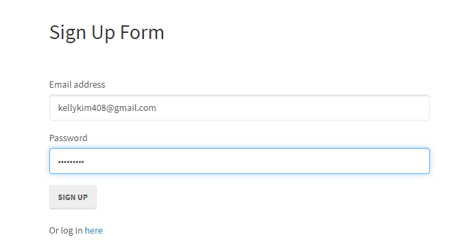
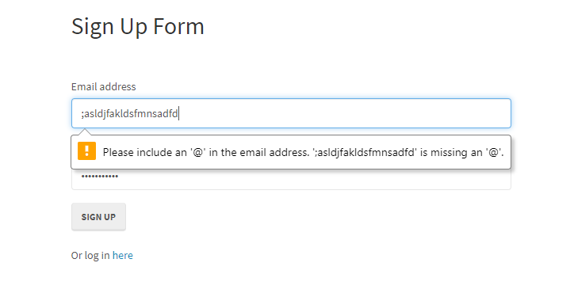
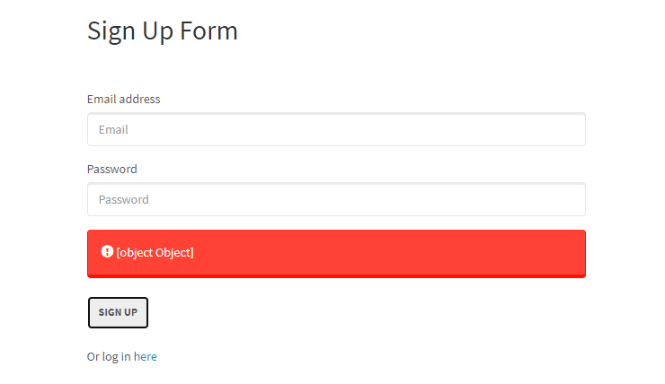
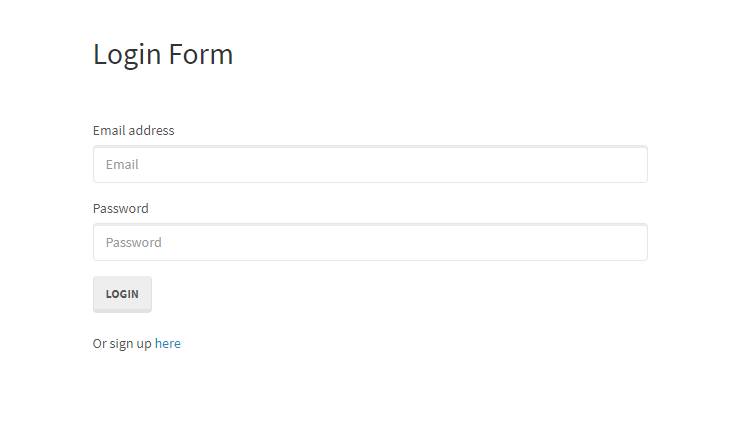

# Reverse_Engineering_Code

 ## Description 
 The reverse engineering code assignment was to reverse engineer a starter code and create a turtorial for the code. This is a simple application that allows users to create an account and log into the account securely. All of the users data is stored in a mysql database. Every file must be explained and its purpose must be thoroughly explained as well. If a file is dependent on another file, this must also be stated.  

## Process
  Dissecting the code is a tedious process, but going through each file to understand how they are connected helped me grasp how this passport demo worked. You will need VS code and the dependencies are Bcryptjs, Express, Express-session, MySql2, passport, passport-local and sequelize. Please see below for my tutorial:

 ## Tutorial
 To get started, you will need to do the following to open up the application:
 1) Navigate to the server.js file and then right click and open it in the integrated terminal. 
 2) Install the necessary dependencies by typing in : NPM Install Bcryptjs Express Express-session MySql2 passport passport-local sequelize.
 3) Go to the config.json file and inside the development section you will need to update the password to reflect your password for MySQL Workbench. You will notice that the database is passport_demo so we will need to add this database into MySql Workbench.
 4) Open your MySql Workbench app and insert the following: 
 -- Drops the passport_demo if it exists currently --
DROP DATABASE IF EXISTS passport_demo;
-- Creates the "passport_demo" database --
CREATE DATABASE passport_demo;

    Now execute the entire script and refresh it in your schemas on the left side.

5) Return to your server.js and run Node server.js inside the integraded terminal. 
6) Once everything is successfully exeucted, you should now see the following message :Listening on port 8080. Visit http://localhost:8080/ in your browser.
7) Go to your web browser and type in localhost:8080 and your application will run and you will be taken to the sign up form. Please see below for some screen shots of the application in action!

  Snippet of the sign up form:
 
 
  If the @ sign is missing then an alert pops up:
 

 If nothing is inputted and the signup button is clicked, then a red alert box pops up:
 

 Here is a snippet of the login form:
 

## Files Explained

1) The isAuthenticated.js file restricts routes that the user is not allowed to visit if they are not logged in. If the user is logged in, it continues with the request.

2) The config.json file is the connection configuration to connect to the server.

3) The passport.js file contains javascript logic that tells passport that the user wants to log in with their established email address and password.

4) The index.js file connects to the database and imports the users log-in data.

5) The user.js file requires "bcrypt" for password hashing. This file creates a custom method for our User model. This will check if an unhashed password entered by the user can be compared to the hashed password stored in our database.

6) The node_modules folder contains libraries downloaded from npm. These files are just a set of functions you want to include in your application.

7) The login.js file validates that there is an email and password entered when the user submits the form.

8) The members.js file does a GET request to figure out which user is logged in and updates the HTML on the page.

9) The signup.js file validate the email and password are not blank when the signup button is clicked.

10) The style.css file styles and specifies on how the html files will be styled like the page layout, colors and fonts.

11) The login.html file is how the login section will be structured and displayed. 

12) The members.html file shows how the members name will be displayed along with a welcome message.

13) The signup.html file shows how the sign-up section will be structured and displayed.

14) The api-routes.js file contains routes for signing in, logging out and getting users specific data to be displayed on the clients side. Using the passport.authenticate middleware with our local strategy, if the user has valid login credentials, send them to the members page, otherwise the user will be sent an error. The user's password is automatically hashed and stored securely since we configured our Sequelize User Model. If the user is created successfully, proceed to log the user in, otherwise send the user back an error.

15) The html-routes.js file is a routes that sends the user to the correct html page. This file requires our custom middleware to check if a user is logged in. Also, if the user already has an account, send them to the members page. This file also adds the isAuthenticated middleware to this route. If a user who is not logged in tries to access this route they will be redirected to the signup page.

16) The .gitignore file is a plain text file where each line contains a pattern for files/directories to ignore. It is to ensure that certain files are not tracked by Git and that they remain untracked. 

17) The package-lock.json file is automatically generated for any operations where npm modifies either the node_modules tree, or package. json. It describes the exact tree that was generated, such that subsequent installs are able to generate identical trees, regardless of intermediate dependency updates.

18) The package.json contains all of the package info, node modules used, version info etc.

19) The server.js file requires packages, sets up  the PORT, creates express and middleware, creates routes and syncs database, it logs messages in the terminal on successful connection to the server.

 ## Installation
 You will need VS code and the dependencies are Bcryptjs, Express, Express-session, MySql2, passport, passport-local and sequelize. 
 
 ## Usage 
 The reverse engineering code is to provide a walkthrough of the codebase so that a developer can use it as a starting point for a new project. 

### Installing/Technology Used

The following platforms are required to open this application:

1) VS code
2) GitBash/Terminal
3) GitLab
4) MySql (workbench)

## Built With

* [Node.js](https://nodejs.dev/learn/the-package-json-guide)
* [MySQL Workbench](https://www.mysql.com/products/workbench/)

 ## Authors

* **Kelly Kim** 

- [Link to Github](https://github.com/kellykim831)
- [Link to LinkedIn](https://www.linkedin.com/in/realtorkellykim/)
- [Link to Facebook](https://www.facebook.com/kimkelz)

## Acknowledgments

* [Link to Google](https://www.google.com)
* [Link to Node.js](https://nodejs.org/en/)